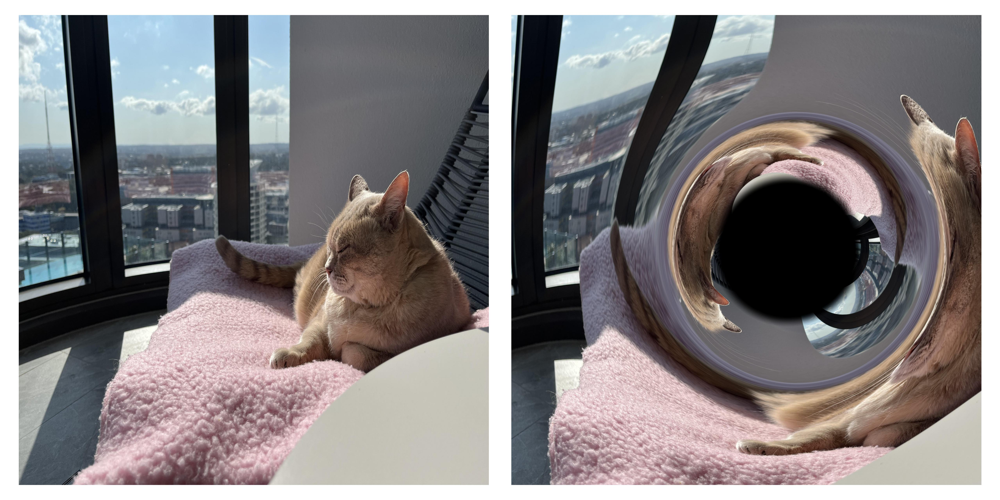

# Microlens-Image

Creating your own microlensing image is easy! The first step is to make sure your python installation has [numpy](https://numpy.org/install/), [matplotlib](https://matplotlib.org/stable/install/index.html), [astropy](https://www.astropy.org/) and [scipy](https://scipy.org/install/) installed. If that is not the case for you then follow the above links to install them.

The next step is to download the microlens_image.py file and put it in a directory which you know how to access. Then simply run the file with:
    python microlens_image.py <input_image> <output_image>

For example:
    python microlens_image.py input.jpg output.jpg

The code will then load in the input image, apply a microlensing effect to the middle of it and save the resultant image to the output_image location. 

If you are looking to explore creating your own Galactic Underworld then see the [StellarMortis repository](https://github.com/David-Sweeney/StellarMortis).
